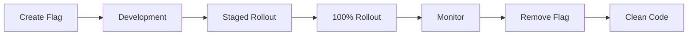

## What are Feature Flag Antipatterns?

**Feature flags** (or feature toggles) are powerful when used correctly. But they become antipatterns when:

- They conflict with each other
- They're never removed after feature rollout
- They have complex interdependencies
- They're checked inconsistently

<div class="wrong-way">

## Real Example from the Project

</div>

<div class="file-path">src/config/feature.flags.js</div>

```javascript title="src/config/feature.flags.js"
// ANTIPATTERN: Feature Flag Chaos!

// Flags that conflict with each other
export const flags = {
  // Which checkout do we use??
  USE_NEW_CHECKOUT: true,
  USE_OLD_CHECKOUT: true,     // Both true!
  USE_LEGACY_CHECKOUT: false,
  CHECKOUT_V2_ENABLED: true,
  ENABLE_CHECKOUT_BETA: false,
  
  // Abandoned flags - nobody knows what these do
  TEMP_FIX_2019: true,
  JOHNS_EXPERIMENT: true,
  REVERT_IF_BROKEN: false,
  OLD_AUTH_FALLBACK: true,
  
  // Flags with complex dependencies
  ENABLE_FEATURE_A: true,
  ENABLE_FEATURE_B: true,   // Requires A
  ENABLE_FEATURE_C: false,  // Conflicts with B
  ENABLE_FEATURE_D: true,   // Requires B and NOT C
  
  // Environment-specific flags in code
  IS_PRODUCTION: process.env.NODE_ENV === 'production',
  IS_STAGING: process.env.NODE_ENV === 'staging',
  DEBUG_MODE: true, // Left on in production!
  
  // Percentage rollouts with no management
  ROLLOUT_PERCENTAGE: 50,
  A_B_TEST_VARIANT: 'B', // Hardcoded!
}

// Functions that check flags inconsistently
export function shouldUseNewCheckout(user) {
  // Complex, contradictory logic
  if (flags.USE_NEW_CHECKOUT && !flags.USE_OLD_CHECKOUT) {
    return true
  }
  if (flags.CHECKOUT_V2_ENABLED && user?.tier === 'premium') {
    return true
  }
  if (flags.ENABLE_CHECKOUT_BETA && Math.random() < 0.5) {
    return true // Random behavior!
  }
  return false
}

// Flags checked in different ways throughout codebase
export function isFeatureEnabled(name) {
  return flags[name] === true
}

export function getFlag(name) {
  return flags[name] // Might be boolean, number, string...
}

// Direct access also used
// if (flags.SOME_FLAG) { ... }
```

### Scattered Flag Checks

```javascript title="Various files"
// file1.js - Direct access
if (flags.USE_NEW_CHECKOUT) { ... }

// file2.js - Helper function
if (isFeatureEnabled('USE_NEW_CHECKOUT')) { ... }

// file3.js - Different flag for same feature!
if (flags.CHECKOUT_V2_ENABLED) { ... }

// file4.js - Typo not caught
if (flags.USE_NEW_CHEKOUT) { ... } // undefined = falsy

// file5.js - Inverted check
if (!flags.USE_OLD_CHECKOUT) { ... }
```

## Why It's Bad

### 1. Conflicting Flags

```javascript
// What happens when both are true?
USE_NEW_CHECKOUT: true
USE_OLD_CHECKOUT: true

// Some code checks one, some checks the other
// User gets inconsistent experience
```

### 2. Flag Debt

```javascript
// These flags will live forever
TEMP_FIX_2019: true      // "Temporary" 5 years ago
JOHNS_EXPERIMENT: true   // John left the company
REVERT_IF_BROKEN: false  // What was broken?
```

### 3. Complex Dependencies

```javascript
// To enable D, you need:
// - A enabled
// - B enabled (which requires A)
// - C disabled (which conflicts with B)
// Good luck figuring that out!
```

### 4. Inconsistent Checks

```javascript
// Three ways to check the same flag
if (flags.FEATURE_X)
if (isFeatureEnabled('FEATURE_X'))
if (getFlag('FEATURE_X') === true)

// Easy to use wrong method or wrong flag name
```

---

<div class="right-way">

## The Right Way

</div>

### 1. Feature Flag Service

```javascript title="src/services/featureFlag.service.js"
class FeatureFlagService {
  constructor(config) {
    this.flags = new Map()
    this.loadFlags(config)
  }
  
  loadFlags(config) {
    for (const [name, definition] of Object.entries(config)) {
      this.flags.set(name, {
        enabled: definition.enabled,
        rolloutPercentage: definition.rollout ?? 100,
        allowedUsers: definition.allowedUsers ?? [],
        dependencies: definition.requires ?? [],
        expiresAt: definition.expiresAt ?? null,
      })
    }
  }
  
  isEnabled(flagName, context = {}) {
    const flag = this.flags.get(flagName)
    
    if (!flag) {
      console.warn(`Unknown flag: ${flagName}`)
      return false
    }
    
    // Check expiration
    if (flag.expiresAt && new Date() > new Date(flag.expiresAt)) {
      console.warn(`Expired flag: ${flagName}`)
      return false
    }
    
    // Check master switch
    if (!flag.enabled) {
      return false
    }
    
    // Check dependencies
    for (const dep of flag.dependencies) {
      if (!this.isEnabled(dep, context)) {
        return false
      }
    }
    
    // Check user allowlist
    if (flag.allowedUsers.length > 0 && context.userId) {
      if (flag.allowedUsers.includes(context.userId)) {
        return true
      }
    }
    
    // Check rollout percentage
    if (flag.rolloutPercentage < 100 && context.userId) {
      const hash = this.hashUserId(context.userId, flagName)
      return hash < flag.rolloutPercentage
    }
    
    return true
  }
  
  hashUserId(userId, flagName) {
    // Consistent hash for user+flag
    const str = `${userId}:${flagName}`
    let hash = 0
    for (const char of str) {
      hash = ((hash << 5) - hash) + char.charCodeAt(0)
    }
    return Math.abs(hash) % 100
  }
}
```

### 2. Typed Flag Definitions

```javascript title="src/config/features.js"
// Clear, documented flag definitions
export const FEATURES = {
  NEW_CHECKOUT: {
    enabled: true,
    description: 'New streamlined checkout flow',
    owner: 'checkout-team',
    createdAt: '2024-01-15',
    expiresAt: '2024-06-01', // Must be cleaned up!
    rollout: 100,
  },
  
  PREMIUM_DASHBOARD: {
    enabled: true,
    description: 'Enhanced dashboard for premium users',
    owner: 'dashboard-team',
    requires: [], // No dependencies
    rollout: 50, // 50% rollout
  },
  
  BETA_SEARCH: {
    enabled: true,
    description: 'New search algorithm',
    owner: 'search-team',
    allowedUsers: ['beta-tester-1', 'beta-tester-2'],
    rollout: 0, // Only allowlisted users
  },
}
```

### 3. Single Point of Access

```javascript title="src/middleware/features.js"
// Inject feature service into request context
export function featureFlagMiddleware(featureService) {
  return (c, next) => {
    const user = c.get('user')
    
    c.set('features', {
      isEnabled: (flagName) => {
        return featureService.isEnabled(flagName, {
          userId: user?.id,
          tier: user?.tier,
          environment: process.env.NODE_ENV,
        })
      },
    })
    
    return next()
  }
}
```

```javascript title="Usage in handlers"
function checkoutHandler(c) {
  const features = c.get('features')
  
  if (features.isEnabled('NEW_CHECKOUT')) {
    return newCheckoutFlow(c)
  }
  
  return legacyCheckoutFlow(c)
}
```

### 4. Flag Lifecycle Management

```javascript title="src/scripts/flag-audit.js"
// Script to find stale flags
async function auditFlags() {
  const flags = await loadFlags()
  const codebase = await scanCodebase()
  
  for (const [name, flag] of Object.entries(flags)) {
    // Check for expired flags
    if (flag.expiresAt && new Date() > new Date(flag.expiresAt)) {
      console.warn(`EXPIRED: ${name} expired on ${flag.expiresAt}`)
    }
    
    // Check for unused flags
    const usages = codebase.findUsages(name)
    if (usages.length === 0) {
      console.warn(`UNUSED: ${name} has no code references`)
    }
    
    // Check for old flags
    const age = Date.now() - new Date(flag.createdAt)
    if (age > 90 * 24 * 60 * 60 * 1000) { // 90 days
      console.warn(`OLD: ${name} is ${Math.floor(age / 86400000)} days old`)
    }
  }
}
```

### 5. Testing with Flags

```javascript title="test/checkout.test.js"
describe('Checkout', () => {
  it('uses new checkout when flag enabled', () => {
    const mockFeatures = {
      isEnabled: (name) => name === 'NEW_CHECKOUT',
    }
    
    const result = checkoutHandler(
      createMockContext({ features: mockFeatures })
    )
    
    expect(result.flow).toBe('new')
  })
  
  it('uses legacy checkout when flag disabled', () => {
    const mockFeatures = {
      isEnabled: () => false,
    }
    
    const result = checkoutHandler(
      createMockContext({ features: mockFeatures })
    )
    
    expect(result.flow).toBe('legacy')
  })
})
```

---

## Comparison

| Flag Chaos | Managed Flags |
|------------|---------------|
| Boolean variables | Typed definitions |
| Direct access | Service abstraction |
| No expiration | Automatic cleanup alerts |
| Hidden dependencies | Explicit requires |
| Scattered checks | Single access point |
| No audit trail | Full lifecycle tracking |

---

## Flag Lifecycle



### Rules for Healthy Flags

1. **Every flag has an owner** - Someone responsible
2. **Every flag has an expiration** - Max 90 days
3. **Remove flags after full rollout** - Don't accumulate
4. **Document dependencies** - Make them explicit
5. **Single way to check** - Use the service
6. **Alert on stale flags** - Automated cleanup

:::tip[Feature Flag Rule of Thumb]
If a flag has been at 100% for more than 2 weeks, remove it. The flag served its purpose - gradual rollout - and is now just technical debt.
:::
